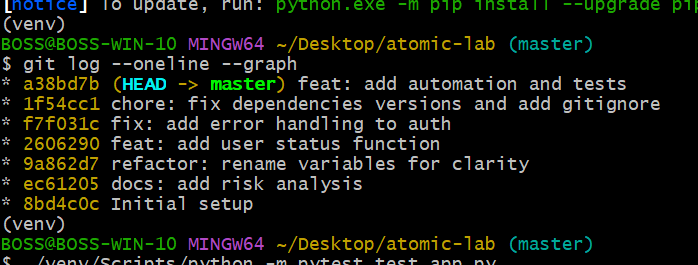
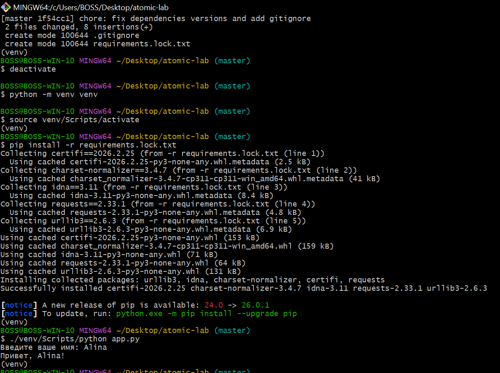
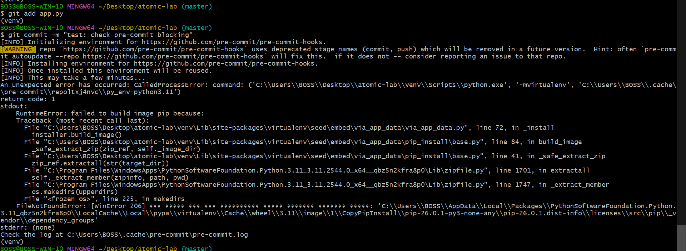

# Отчет по лабораторной работе: Атомарные коммиты и автоматизация

## 1. Демонстрация атомарности (git log)
Ниже представлена история коммитов, где каждое изменение (фикс, рефакторинг, фича) вынесено в отдельный коммит.

## 2. Восстановление окружения и запуск тестов
Процесс создания чистого виртуального окружения, установки зависимостей из lock-файла и успешный прогон тестов.

## 3. Сработка pre-commit хука
Демонстрация блокировки коммита при нарушении правил оформления кода (лишние пробелы/пустые строки).

## 4. Ответы на контрольные вопросы

1. **Как git add -p помогает при отладке через git bisect?**
Использование ключа -p позволяет разбивать изменения на мелкие части (ханты). Это делает историю чистой, и если возникнет ошибка, git bisect укажет на конкретный мелкий коммит с багом, а не на огромный блок изменений.

2. **Почему наличие requirements.lock.txt критично для командной работы?**
Он фиксирует точные версии всех зависимостей. Это гарантирует, что у всех участников команды будет абсолютно одинаковое окружение, что исключает ошибки «у меня на компе всё работало».

3. **В чем преимущество Makefile перед текстовой инструкцией в README?**
Makefile — это исполняемый файл. Вместо ручного ввода длинных команд, пользователь вводит одну короткую команду (например, make install), что исключает человеческий фактор.

4. **Как тесты реализуют принцип «живой документации» и почему важен seed?**
Тесты наглядно показывают ожидаемые входные и выходные данные функции. Фиксация seed гарантирует воспроизводимость результатов при использовании случайных чисел.

5. **Что произойдет, если удалить папку venv и выполнить make install на чистой машине?**
Произойдет полная автоматическая репликация рабочего окружения. Благодаря наличию файла Makefile, система выполнит последовательность заложенных в него команд: создаст новую изолированную директорию venv и установит в неё все необходимые библиотеки, строго соблюдая версии, зафиксированные в requirements.lock.txt.